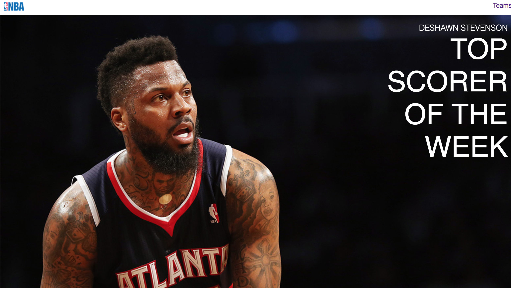
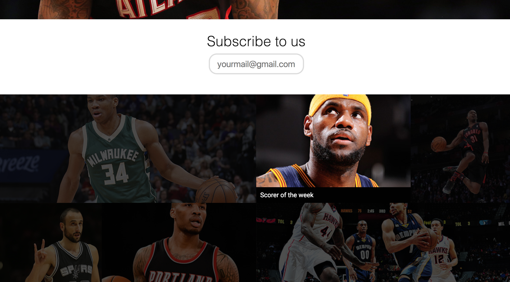
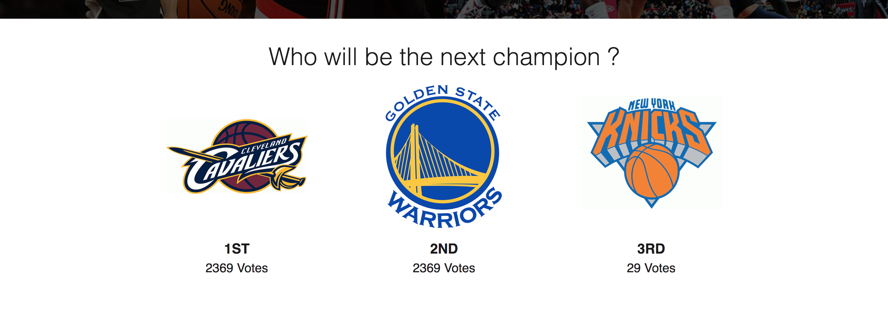
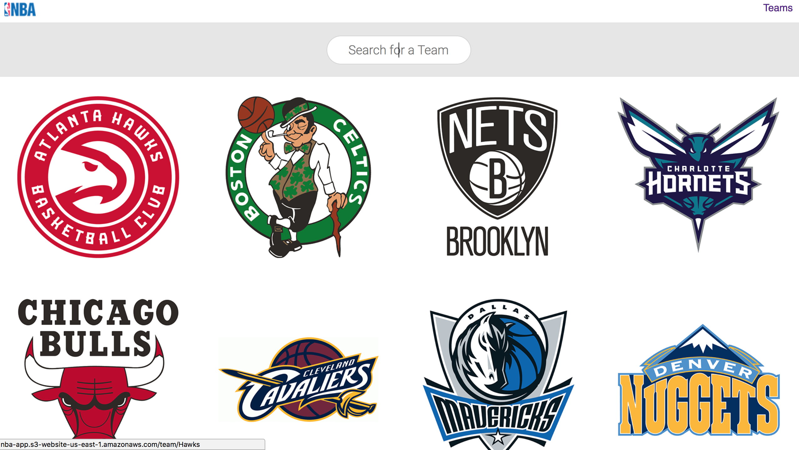
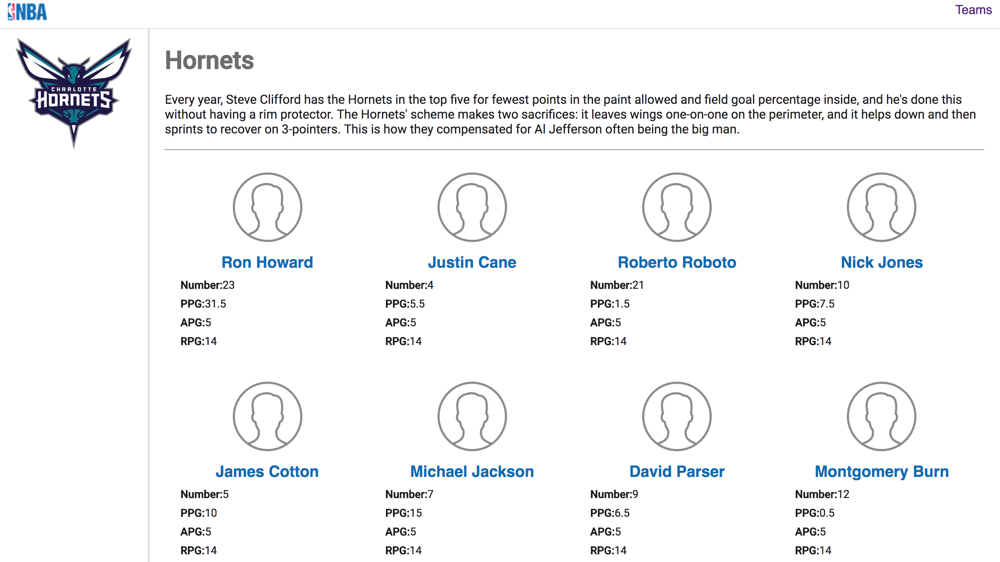

React-Application:

Deployed on AWS S3 @ [NBA-APP](http://nba-app.s3-website-us-east-1.amazonaws.com/).  If data isn't loading please refresh the page. 

## How to Run

Run `npm install` to download all the required Node Modules. Once all the dependencies are installed. You can now go and start the application using the command `npm start`.

## What is done here?

This web application is a demostration of React application which uses React-Transition-Group and React-Slick for simple animations.
As of now, this application will allow user to view information about variuos NBA teams, latest news, allows him to subscribe to emails and vote for his favourite team.

# Screenshots

## Home Page

Home Page -  This is opening/welcome page to the application

## Transitions 

Subscription - Allows a user to subscribe for emails and view latest news.

## Voting

Voting - Allows a user to cast vote for his favourite team in Top 3

## Teams Page 

Teams Page - Displays all the NBA Teams

## Team Page

Team Page - Gives player information of a particular team
